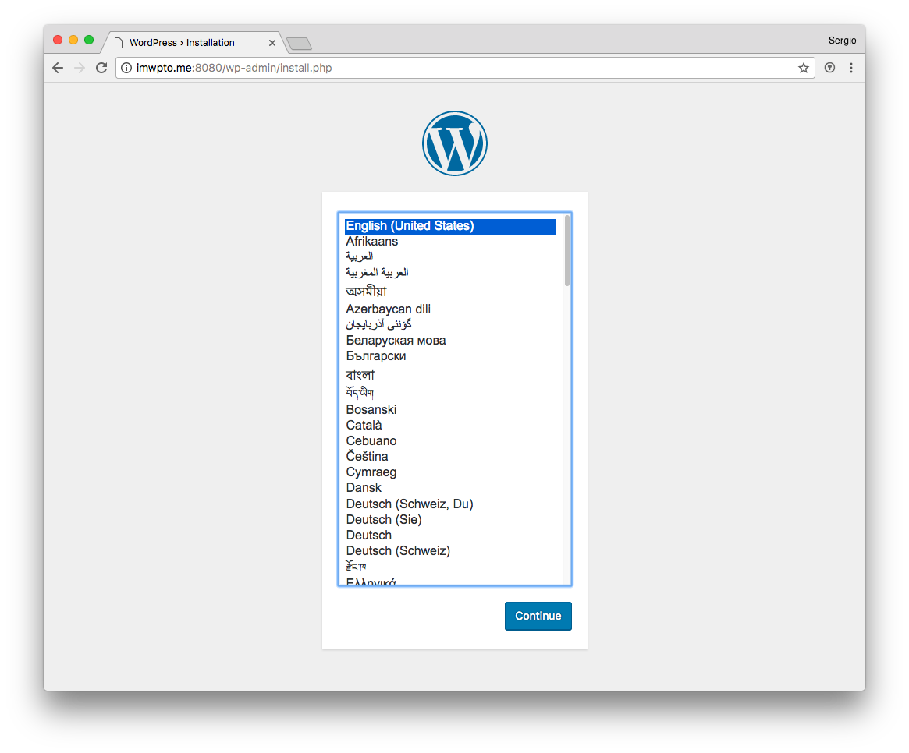

# Dockerizando Wordpress

En primer lugar vamos a crear un fichero para componer nuestros contenedores:

~~~console
sdelquin@cloud:~$ mkdir wordpress
sdelquin@cloud:~$ cd wordpress
sdelquin@cloud:~/wordpress$ vi docker-compose.yml
~~~

> Contenido:

~~~yml
version: '3.1'

services:

  wordpress:
    image: wordpress
    restart: always
    ports:
      - 8080:80
    environment:
      WORDPRESS_DB_PASSWORD: mydocker2018

  mysql:
    image: mysql
    restart: always
    environment:
      MYSQL_ROOT_PASSWORD: mydocker2018
~~~

Ahora lanzamos los servicios:

~~~console
sdelquin@cloud:~/wordpress$ docker-compose up
Creating wordpress_wordpress_1 ... done
Creating wordpress_mysql_1     ... done
Attaching to wordpress_mysql_1, wordpress_wordpress_1
...
...
...
~~~

Si accedemos al puerto `8080` en la dirección de nuestra máquina de producción, podremos ver que accedemos al instalador de Wordpress:

 

